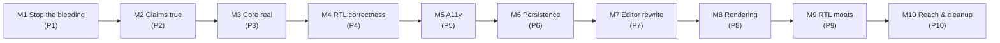
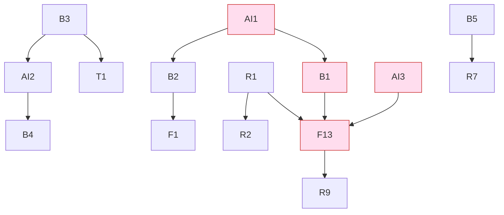

# BP MD RTL Reader — Implementation Plan (PLAN.md)

> **Derived from:** [`SPEC.md`](./SPEC.md) v1.1 · **Status:** Active plan v1.0 · **Owner:** Binary Parse
> **Methodology:** Test-Driven Development (TDD) — every task starts RED (failing test) → GREEN (minimal code) → REFACTOR. See SPEC §12.
> **Branch:** `claude/ultracode-effort-IKrV3` · **PRs:** one per Task ID where practical.

---

## 0. How to use this plan

- **Source of truth is `SPEC.md`.** This file is the *execution* layer: ordered tasks, the tests to write first, files touched, and acceptance.
- Each task lists **RED** (tests to author first), **GREEN** (minimal implementation), **REFACTOR**, **Edge cases** (EC-* from SPEC §10), **Acceptance** (SPEC §8.2), and **Deps**.
- A task is **Done** only when SPEC §8.1 global gates + its own acceptance pass: TDD order shown in history, unit ≥95% coverage, Stryker ≥90% on touched modules, e2e/visual/axe green, 0 runtime network, DI seams intact.
- **Decision gates (SPEC §9):** Q1–Q6 must be resolved before the phases that depend on them (flagged inline).

---

## 1. Working agreement (applies to every task)

| Rule | Detail |
|---|---|
| Test-first | Commit/stage a failing test before production code. Bug fixes begin with a reproducing test. |
| Pure-core-first | Extract logic to `src/**` pure modules; unit + mutation-test there before wiring to Electron/DOM. |
| DI seams | Never break `bootstrap()` / `setupBridge()` / (new) `EditorPort`. They exist to enable TDD without launching the app. |
| Small PRs | One Task ID per PR where feasible; keep diffs reviewable. |
| Gates | SPEC §8.1 runs in CI on every push; red gate blocks merge. |
| No scope creep | Out-of-scope per SPEC §1.3 (no cloud/sync/accounts/plugins/mobile). |

---

## 2. Milestone overview (maps to SPEC §7)

| Milestone | Phase | Exit (SPEC SC) | Key gate decision |
|---|---|---|---|
| M1 | 1 | SC3, SC4, security checklist | — |
| M2 | 2 | SC1, SC2 | — |
| M3 | 3 | SC5 | Q2 (save model) |
| M4 | 4 | SC7 (non-table) | — |
| M5 | 5 | SC8 | — |
| M6 | 6 | session restore | — |
| M7 | 7 | SC6, SC7 (tables) | **Q1, Q4** (engine, drop Split) |
| M8 | 8 | SC9 | Q3 (highlighter) |
| M9 | 9 | Arabic UI shippable | — |
| M10 | 10 | cross-platform builds | Q5, Q6 (signing, updates) |

---

## 3. Phase 1 — Stop the bleeding (M1)

> Small, low-risk, high-value. Removes the link-hijack and empty-menu pain; hardens the renderer.

### T-B11 — Navigation guard
- **RED:** unit tests on `bootstrap` seam: `will-navigate` + `will-redirect` registered; `https` → `preventDefault` + `shell.openExternal`; **exact** app-`index.html` URL allowed; `file://` elsewhere prevented + not opened; non-http (`mailto`/`data`/`javascript`) denied (EC-B5/B6).
- **GREEN:** add guard in `createWindow`; `openExternal` https/mailto/tel only.
- **REFACTOR:** extract URL-classification to a pure helper in `src/main-logic.js` (`classifyNavigation(url, appUrl)`), mutation-tested.
- **Edge cases:** EC-B5, EC-B6. **Acceptance:** SPEC §8.2 B11. **Deps:** —.

### T-B12 — Full context menu
- **RED:** unit tests for menu templates: link, image (`mediaType`), selection, editable, empty-area; link routes https-only; non-http never opened; trailing-separator trimmed; spellcheck suggestions when `misspelledWord` present.
- **GREEN:** rebuild `context-menu` handler off `params.linkURL`/`mediaType`/`selectionText`/`isEditable` + fallback Select-All.
- **REFACTOR:** extract `buildContextMenuTemplate(params)` pure function → `src/main-logic.js`.
- **Edge cases:** EC-B5. **Acceptance:** §8.2 B12. **Deps:** T-B11 (shared `openExternal`).

### T-B13 — Sandbox renderer
- **RED:** BrowserWindow-options test asserts `sandbox:true` (+ existing `contextIsolation`/`nodeIntegration`); e2e probe asserts no Node API in renderer.
- **GREEN:** set `sandbox:true`; audit preload for sandbox-compatibility (no Node requires leaking).
- **Edge cases:** — **Acceptance:** §8.2 B13. **Deps:** preload audit.

| Task | Files | Effort | Risk |
|---|---|---|---|
| T-B11 | `main.js`, `src/main-logic.js`, tests | S | Low |
| T-B12 | `main.js`, `src/main-logic.js`, tests | S–M | Low |
| T-B13 | `main.js`, `preload.js`, tests | S | Med |

**M1 exit:** SC3 + SC4 pass; security checklist (SPEC §5.2) green for navigation/sandbox.

---

## 4. Phase 2 — Make claims true (M2)

> Make "local-first / offline / correct fonts" literally true; introduce the asset-protocol boundary (AI2).

### T-AI2 — Secure asset protocol + content pipeline
- **RED:** protocol resolves only paths under an allow-listed root; `..`/symlink denied; `renderTrusted()` strips Mermaid `<script>`/`<foreignObject>` (fixture); KaTeX bomb bounded (`maxExpand`); link-scheme allow-list.
- **GREEN:** register `bpmd://`; serve bundled vendor + `bpmd://vault/<relPath>` images; implement `renderTrusted()` stage.
- **REFACTOR:** centralize sanitize/link policy in `src/renderer/markdown.js` + a new `src/renderer/trusted.js`.
- **Edge cases:** EC-B1, EC-B2, EC-B3, EC-B4. **Deps:** T-B3.

### T-B3 — Vendor assets (drop CDN)
- **RED:** e2e network probe asserts **0** external requests on cold start (SC2); render works offline (SC1).
- **GREEN:** bundle `marked`, `DOMPurify`, fonts locally; remove CDN `<script>`/`<link>` + SRI.

### T-T1 / T-T3 — Correct + self-hosted fonts
- **RED:** visual-regression for real bold (Latin + Arabic) with `font-synthesis:none`; assert no faux-bold; fonts load from bundle.
- **GREEN:** load the actually-used weights (Fraunces 300/500/600/700 + ital, Inter 400/500/600, JetBrains 400/500, IBM Plex Arabic 400/500/600/700), subset WOFF2, self-host.
- **REFACTOR:** `font-synthesis:none` global; Fraunces `opsz` (T6 optional follow-up).

### T-B4 — CSP
- **RED:** e2e asserts CSP meta present, 0 violations, no inline `<script>`; nonce strategy for needed inline styles.
- **GREEN:** add `default-src 'self'` CSP enabled by AI2/T-B3 bundling.

| Task | Effort | Deps |
|---|---|---|
| T-B3 | S | — |
| T-AI2 | M | T-B3 |
| T-T1/T3 | S | T-B3 |
| T-B4 | S | T-B3, T-AI2 |

**M2 exit:** SC1 + SC2 pass; CSP active; fonts correct.

---

## 5. Phase 3 — Core feature real (M3)  · *gate: Q2 (save model)*

> Introduce the DocumentStore (AI1); make save + nested vault + tree real.

### T-AI1 — Transactional DocumentStore
- **RED (pure first):** unit + mutation on store logic — atomic-write fidelity (BOM/EOL/final-newline, EC-A1); conflict reject on stale `mtime`/hash (EC-A2); traversal/realpath rejection (EC-A4); symlink-cycle termination + tree caps (EC-A5); lazy body load (EC-A6); typed errors (EC-A7).
- **GREEN:** implement `DocumentStore` in main; expose `changed`/`conflict` events.
- **REFACTOR:** route existing `fs:readVault` reads through the store; pure path/encoding helpers in `src/main-logic.js`.
- **Edge cases:** EC-A1…A7, EC-D4. **Deps:** —.

### T-B1 — `fs:writeFile` IPC (atomic, allow-listed)
- **RED:** edit→save→disk byte-match (encoding preserved); out-of-allow-list path → `unauthorized-path`; crash-safety (temp+rename) simulated.
- **GREEN:** add `fs:writeFile` to preload + main, backed by AI1; wire `saveCurrent`/`saveAs`.
- **Decision:** **Q2** — autosave vs explicit save (recommended: autosave + manual flush + "saved" indicator).
- **Deps:** T-AI1.

### T-B2 — Recursive vault
- **RED:** nested-folder vault returns all `.md` with correct `relPath`; depth-bounded; whole-tree caps; symlink-escape rejected.
- **GREEN:** recursion in `readVault` via AI1; extend `filterAndSortMdFiles` for `relPath`.
- **Deps:** T-AI1.

### T-F1 — Folder tree UI
- **RED:** renderer unit (mock data): hierarchy build, collapse/expand state, keyboard nav, RTL filename isolation; selection drives active note.
- **GREEN:** replace flat `renderTree` with hierarchical render.
- **Deps:** T-B2.

| Task | Effort | Deps |
|---|---|---|
| T-AI1 | M | — |
| T-B1 | M | T-AI1, **Q2** |
| T-B2 | M | T-AI1 |
| T-F1 | M | T-B2 |

**M3 exit:** SC5 (edits persist); nested vault + folder tree work.

---

## 6. Phase 4 — RTL correctness (M4)

> Beat competitors on *default-correct* bidi. BidiService is pure and heavily tested (precursor to AI3).

### T-R1 — Per-line/block direction
- **RED:** `BidiService` unit: first-strong direction per block; neutral-line inheritance (EC-C1); `dir=auto` + `unicode-bidi:plaintext` mapping.
- **GREEN:** apply per-block direction in render pipeline (replaces whole-doc flip).

### T-R2 — Bidi isolation everywhere
- **RED:** snapshot tests — inline code/link/number/tag isolated inside lists, quotes, callouts, tables, code (the Obsidian failure set).
- **GREEN:** wrap inline neutral/opposite runs in `<bdi>`/`isolate` across all block renderers.

### T-R3/R4/R5 — Arabic typography & numerals
- **RED:** computed-style tests: Arabic `line-height ≥1.8` (≥2.0 with tashkeel), no `letter-spacing`, no inter-char justify; numerals toggle switches digit shape; numbers stay LTR.
- **GREEN:** Arabic type defaults + ligatures (real weights from T1); `numerals` setting (`western`/`arabic-indic`).

| Task | Effort | Deps |
|---|---|---|
| T-R1 | M | (AI3 ideal) |
| T-R2 | M | T-R1 |
| T-R3/4/5 | S | T-T1 |

**M4 exit:** SC7 for non-table content (mixed AR/EN correct).

---

## 7. Phase 5 — Accessibility (M5)

> WCAG 2.2 / EAA baseline. Cheap, independent, high-ROI.

| Task | RED (test-first) | EC |
|---|---|---|
| T-F2 | every icon control exposes `aria-label`; Arabic runs tagged `lang="ar"` | EC-C6 |
| T-F3 | toast region `role="status"`/`aria-live="polite"` announces | — |
| T-F4 | modal & palette trap + restore focus; nested-overlay Esc order | EC-C7 |
| T-F5 | dropdown menus fully arrow-key operable (roving focus) | — |
| T-T4 | UI sizing in `rem`; app-wide zoom scales chrome | — |
| T-T5 | min label size ≥11px (or scales with T4) | — |

**M5 exit:** SC8 (axe 0 serious/critical; keyboard-only traversal; visible focus).

---

## 8. Phase 6 — Persistence & docs (M6)

| Task | RED | EC |
|---|---|---|
| T-B5 | relaunch restores theme/zoom/mode/panels/recents/window/last-session; corrupt settings → defaults; off-screen bounds clamped | EC-D1, EC-D2 |
| T-F8 | UI prefs (direction/zoom/mode/panels) persisted + restored | — |
| T-B8 | docs reconciled with real behavior (save semantics, persisted data, offline) | — |

**M6 exit:** session restore verified; `PRIVACY.md`/`README` match behavior.

---

## 9. Phase 7 — Editor rewrite, flagship (M7)  · *gate: Q1, Q4*

> The big one. Ports-&-adapters keeps it test-driven and reversible.

### T-AI3 — EditorPort + adapters
- **RED:** UI suites run against a **mock `EditorPort`**; `BidiService` (from P4) gets caret-stepping tests (EC-C2), IME handling (EC-C3), Arabic slugs (EC-C5).
- **GREEN:** define `EditorPort`; implement `TextareaAdapter` (parity) behind a flag first, then `CodeMirrorAdapter`.
- **Decision:** **Q1** engine (rec: CodeMirror 6), **Q4** drop Split.

### T-F13 — Unified Live Preview (CM6)
- **RED:** inactive lines render formatted; active line shows raw tokens; Source toggle; selection/scroll preserved across edits; per-line direction + cursor correct in mixed text; **perf**: 10k-line doc <100ms initial, <16ms/keystroke region; find re-homed on `EditorPort.find` (EC-C4).
- **GREEN:** `CodeMirrorAdapter` with live-preview decorations; remove 3-mode switch.

### T-R9 — Bidi tables + cursor
- **RED:** mixed-direction table: columns mirror RTL, each cell `dir=auto`, **logical** arrow-key cell traversal (EC-C2); interaction + snapshot.
- **GREEN:** table direction + cursor logic in adapter/BidiService.

| Task | Effort | Risk | Deps |
|---|---|---|---|
| T-AI3 | L | Med | **Q1, Q4** |
| T-F13 | L | High | T-AI3, T-B1, T-R1 |
| T-R9 | M | Med | T-F13 |

**M7 exit:** SC6 + SC7 (tables) pass; one editing mode.

---

## 10. Phase 8 — Rendering baseline (M8)  · *gate: Q3*

| Task | RED | Notes |
|---|---|---|
| T-F9 | code highlight + KaTeX render tests + visual snapshot; KaTeX `trust:false`/limits (EC-B4) | Q3 highlighter |
| T-F14 | callouts `> [!NOTE]` (+TIP/IMPORTANT/WARNING/CAUTION) render | extension |
| T-F15 | GFM task-list checkboxes render + toggle | |
| T-F16 | mermaid renders; SVG sanitized (EC-B3) | lazy + AI2 pipeline |
| T-F7 | outline h1–h6 + scroll-sync; Arabic slugs (EC-C5) | |
| T-B6/F6 | `printToPDF` IPC + PDF export of current note | |

**M8 exit:** SC9 (all baseline features render).

---

## 11. Phase 9 — RTL moats (M9)

| Task | RED | Differentiator |
|---|---|---|
| T-R7 | full UI flips (layout + glyphs mirrored) + localizes (en/ar) via `uiLocale`; persisted; RTL chrome visual snapshot | **unique** |
| T-R8 | Hijri calendar option for Daily Notes | unique |
| T-R10 | Arabic justification policy (ragged default; optional OpenType kashida) | unique |
| T-R6 | per-note direction via front matter + manual per-line override | built-in parity |

**M9 exit:** fully Arabic, mirrored UI shippable.

---

## 12. Phase 10 — Reach & cleanup (M10)  · *gate: Q5, Q6*

| Task | RED/Check | Notes |
|---|---|---|
| T-B7 | macOS/Linux build matrix produces artifacts; entitlements for user-selected folders | Q5 signing/notarization |
| T-B9 | `fs.watch` → store `changed` event → renderer refresh; conflict path (EC-A2) | via AI1 |
| T-B10 | `.txt` handling consistent (drag-drop vs vault filter) | |
| T-F10/F11 | cosmetics (double ◆, dead Recent, `.sb-stat` pointer); italic opt-out; mirror chevrons | |
| T-T6 | Fraunces `opsz` optical sizing | |
| T-F12 | decompose `index.html` into modules (do last; churn multiplier) | |
| Q6 | opt-in update-check (no auto-download), privacy-preserving (EC-D3) | |

**M10 exit:** cross-platform signed builds; codebase modularized.

---

## 13. Critical path & dependencies

**Longest pole:** `AI1 → B1 → F13` and `AI3 → F13 → R9` (the editor rewrite). Everything in P1–P2 is parallelizable and unblocked today.

---

## 14. Decision gates (resolve before dependent phases)

| Q | Decision | Blocks | Recommendation |
|---|---|---|---|
| Q2 | Save model (autosave vs explicit) | P3 / T-B1 | Autosave + manual flush + indicator |
| Q1 | Editor engine | P7 / T-AI3 | CodeMirror 6 |
| Q4 | Drop "Split" mode | P7 / T-F13 | Drop; unified + Source toggle |
| Q3 | Highlighter | P8 / T-F9 | Shiki if bundle OK, else highlight.js |
| Q5 | Code signing | P10 / T-B7 | Acquire certs for notarization |
| Q6 | Update channel | P10 | Opt-in check-only, no auto-download |

---

## 15. Risk register

| Risk | Phase | Mitigation |
|---|---|---|
| Editor rewrite scope blow-up | P7 | `EditorPort` + `TextareaAdapter` fallback; ship behind flag |
| Data loss on save | P3 | AI1 conflict model + atomic write; reproducing tests first |
| CSP breaks inline styles | P2 | nonce/protocol via AI2; incremental tighten |
| Mermaid/KaTeX XSS/DoS | P8 | AI2 sanitize stage; fixtures in RED tests |
| Arabic bidi regressions | P4/P7 | `BidiService` pure unit + mutation; snapshot per block type |
| Mutation score drops on new modules | all | TDD enforced; Stryker ≥90% gate on touched files |

---

## 16. Status tracker

> Update on every task. `☐ todo · ◐ in-progress · ☑ done`

| Phase | Tasks | Status |
|---|---|---|
| P1 | T-B11, T-B12, T-B13 | ☐ |
| P2 | T-B3, T-AI2, T-T1/T3, T-B4 | ☐ |
| P3 | T-AI1, T-B1, T-B2, T-F1 | ☐ |
| P4 | T-R1, T-R2, T-R3/4/5 | ☐ |
| P5 | T-F2…F5, T-T4/T5 | ☐ |
| P6 | T-B5, T-F8, T-B8 | ☐ |
| P7 | T-AI3, T-F13, T-R9 | ☐ |
| P8 | T-F9, F14, F15, F16, F7, B6/F6 | ☐ |
| P9 | T-R7, R8, R10, R6 | ☐ |
| P10 | T-B7, B9, B10, F10/F11, T6, F12 | ☐ |

---

*End of PLAN.md — v1.0. Tracks `SPEC.md` v1.1. All work is test-first (SPEC §12).*
