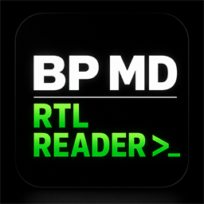

<div align="center">



# BP MD RTL Reader

**A local-first Markdown editor and reader for Windows, macOS, and Linux, with
first-class right-to-left support for Arabic.**

Opens plain `.md` files from disk. No proprietary format, no account, no telemetry.

[](CHANGELOG.md)
[](#download)
[](LICENSE)
[](https://www.electronjs.org/)
[](docs/BUILD.md#testing)


</div>

---

## Overview

BP MD RTL Reader is a desktop Markdown application built on Electron. It opens a single
file or several folders of `.md` notes, renders them for reading, and edits them in a
live-preview editor. Files are read from and written to disk in place — there is no
database, no sync service, and no proprietary container.

Its distinguishing concern is **bidirectional text**. Most Markdown editors treat
right-to-left languages as an afterthought: a global "RTL mode" that flips the entire
interface, or nothing at all. This one detects direction **per block**, so a document that
mixes Arabic prose with English code samples renders each paragraph in its own correct
direction, with proper bidi isolation, Arabic-aware typography, and mirrored layout for
quotes, lists, and tables.

**What it does**

- **Bidirectional by design.** Automatic per-block direction detection, manual override
  per document, Unicode bidi isolation, and Arabic-aware fonts and justification.
- **Several folders at once.** Open more than one folder; each becomes a named root in the
  file tree and can be closed independently, without disturbing the others.
- **Reading and editing.** A reading view with a tuned type scale, and a CodeMirror 6
  live-preview editor where the line under the caret shows raw Markdown.
- **Fully offline.** The Markdown engine, sanitizer, math and diagram renderers, syntax
  highlighting, and every font are bundled locally. The renderer makes no network requests.
- **Hardened rendering.** Context isolation on, Node integration off, a minimal preload
  bridge, DOMPurify sanitization, and a strict Content-Security-Policy.

---

## Screenshots

|  Paper (light)  |  Ink (dark)  |  Sepia  |
| :-------------: | :----------: | :-----: |
|  |  |  |

|  Arabic / right-to-left  |  Live-preview editor  |  Command palette  |
| :----------------------: | :-------------------: | :---------------: |
|  |  |  |

---

## Features

| | |
| --- | --- |
| **Bidirectional text** | Per-block Arabic/RTL detection; manual direction flip; Unicode bidi isolation; Arabic-aware fonts, alignment, and optional kashida justification; mirrored quotes, lists, and tables |
| **Workspace** | Open several folders at once, each a named root in the tree; per-folder close; tabbed editing; folder-wide search; `#tags`; recent files; session restore |
| **Editor** | A single CodeMirror 6 live-preview surface — text renders as you type while the caret line shows raw Markdown; adjustable reading width and text size; app zoom 60–200% |
| **Writing** | Toolbar for Bold/Italic/Strikethrough/Code, H1–H6, lists, quotes, and callouts; interactive tables (add and remove rows and columns, `Tab` between cells); links, images, footnotes; highlight, sub/superscript, indent/outdent; shortcuts (`Ctrl+B`/`I`, `Ctrl+1`–`6`) |
| **Markdown** | Headings, lists and task lists, tables, blockquotes, callouts, footnotes, fenced code with syntax highlighting, KaTeX math, Mermaid diagrams, `==highlight==`, `<u>`, and sub/superscript — via [marked](https://marked.js.org/), [DOMPurify](https://github.com/cure53/DOMPurify), [KaTeX](https://katex.org/), [highlight.js](https://highlightjs.org/), and [Mermaid](https://mermaid.js.org/), all bundled locally |
| **Linking** | `[[wiki-links]]` with `[[target\|alias]]` aliases; click to jump; document outline |
| **Productivity** | Command palette (`Ctrl+K`); find-in-document (`Ctrl+F`); daily notes; PDF and HTML export; drag-and-drop |
| **Interface** | Three themes (Paper, Ink, Sepia) remembered across sessions; a fully Arabic interface option; frameless window; optional auto-hiding chrome; keyboard-first navigation |

Full **[Keyboard Shortcuts](docs/KEYBOARD_SHORTCUTS.md)** reference, or press `Ctrl+/` in
the app. Every feature is documented in the **[User Guide](docs/USER_GUIDE.md)**.

---

## Download

Builds are published on the
[Releases](https://github.com/Binary-Parse/BP-MD-RTL-Reader/releases) page.

| Platform | Files | Notes |
| -------- | ----- | ----- |
| **Windows 10/11** | `…-Windows-NSIS-multiarch.exe`, `…-Windows-Inno-x64.exe` | Signed installers; NSIS covers x64, 32-bit, and ARM64, Inno is x64 |
| **Windows portable** | `…-Windows-Portable-multiarch.exe` | Signed; no installation required |
| **macOS** | x64 and arm64 `.dmg` or `.zip` | Both architectures are signed and notarized by Apple |
| **Linux** | x64 and arm64 `.AppImage` or `.deb` | Package and architecture per distribution |

Every release also ships `SHA256SUMS.txt` and a source manifest for the Inno payload.
Verify the checksum before running a downloaded file; the exact file names and commands
are in [docs/BUILD.md](docs/BUILD.md). (Releases are built locally per
[docs/BUILD.md](docs/BUILD.md) — GitHub Actions is not used to cut them, so there are
no automated build-provenance attestations; the checksum file is the verification
artifact.)

---

## Quick start

1. Install and launch the app; it opens to a welcome screen.
2. Open a file with `Ctrl+O`, or a folder of notes with `Ctrl+Shift+O`. Open a second
   folder the same way — it is added alongside the first, not in place of it. To load a
   bilingual sample set, choose **Try Demo Notes**.
3. Switch themes with `Ctrl+Shift+D`, flip text direction with `Ctrl+Shift+L`, toggle
   reading and editing with `Ctrl+E`, and press `Ctrl+K` for the command palette.

---

## Privacy and security

The app is local-first. It performs no telemetry, analytics, crash upload, or automatic
update check.

- Notes stay wherever the plain Markdown files live. Settings, recent paths, local logs,
  and filesystem grants are kept in the app profile — `%APPDATA%\BP MD RTL Reader` on
  Windows.
- The renderer runs with `contextIsolation` enabled and `nodeIntegration` disabled behind
  a minimal preload bridge. Rendered HTML is sanitized with DOMPurify under Trusted Types.
  Packaged builds serve the interface over `app://` rather than `file://` inside the asar.
- The renderer issues no outbound requests. Markdown parsing, sanitization, maths,
  highlighting, diagrams, and fonts are all bundled and loaded under a strict
  Content-Security-Policy (`connect-src 'self'`).
- Folder access is capability-based: absolute paths never cross the preload boundary. The
  main process grants opaque identifiers and enforces containment, size caps, and symlink
  escape checks.
- The only app-level network request is **Help → Check for Updates…**, which reads
  GitHub's public release metadata. It never runs automatically and sends no note content.

Details in **[docs/PRIVACY.md](docs/PRIVACY.md)**.

---

## Build from source

Requires Node.js 24 or newer.

```bash
git clone https://github.com/Binary-Parse/BP-MD-RTL-Reader.git
cd BP-MD-RTL-Reader
npm install      # postinstall also fetches the Chromium used by the e2e tests
npm start        # launch the app in development
npm run dist     # build the Windows installers into dist/
```

Packaging, icon regeneration, signing, and the release pipeline are documented in
**[docs/BUILD.md](docs/BUILD.md)**.

---

## Project structure

```text
build/                 Packaging inputs: icons, entitlements, NSIS, and Inno Setup
resources/vendor/      Offline runtime libraries, fonts, and licence manifests
src/main/              Electron entry point, privileged IPC, storage, window lifecycle
src/preload/           Minimal context-isolated renderer bridge
src/renderer/          Interface, editor, Markdown pipeline, and styles
tests/unit/            Vitest unit suite
tests/e2e/             Playwright browser, integration, visual, a11y, and Electron lanes
tests/installer/       Pester and Inno Setup installer tests
docs/                  Build, usage, keyboard, and privacy documentation
scripts/               Build, verification, coverage, release, and asset tooling
```

---

## Contributing

Bug reports and pull requests are welcome. **[CONTRIBUTING.md](CONTRIBUTING.md)** covers
the development setup, the two Playwright test lanes, the coverage and mutation gates a
change has to pass, and the architectural conventions worth knowing before editing the
renderer. Participation is governed by the
[Code of Conduct](CODE_OF_CONDUCT.md).

Security issues should be reported privately — see [SECURITY.md](SECURITY.md).

---

## License

Released under the [MIT License](LICENSE). Copyright 2026 Binary Parse.

Third-party components and their licences are listed in
[THIRD-PARTY-NOTICES.md](THIRD-PARTY-NOTICES.md).
