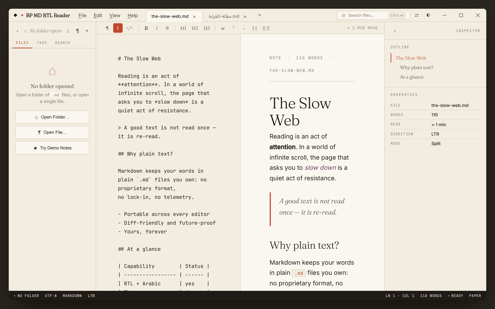

<div align="center">


# BP MD RTL Reader

**A Markdown reader that treats prose like a literary object.**

Bilingual to its core — first-class English **and** Arabic.
Plain `.md` files on disk. No proprietary format. No telemetry.

[](CHANGELOG.md)
[](#-download)
[](LICENSE)
[](https://www.electronjs.org/)
[](docs/BUILD.md#testing)


</div>

---

## Why BP MD RTL Reader?

Most Markdown apps are built for writing code or shipping notes to a cloud. **BP MD
RTL Reader** is built for *reading* — calmly, in either direction of script, from
plain files that stay on your machine.

- 🅰️ **Truly bilingual.** Arabic isn't an afterthought. The app detects Arabic-heavy
  documents and flips to a proper right-to-left layout with Arabic-aware typography —
  and you can flip direction yourself any time.
- 🎨 **Three calm themes.** Paper, Ink, and Sepia — chosen to make long reading easy
  on the eyes. Your choice is remembered.
- 📄 **Just Markdown.** Open a single file or a whole folder of `.md` files. No
  database, no proprietary format, no lock-in.
- 🔒 **Local-first & private.** No telemetry, no analytics, no account, no
  auto-update phone-home. Your words never leave your computer.
- 🛡️ **Hardened by design.** A sandboxed renderer and DOMPurify-sanitised output mean
  opening an untrusted `.md` file is safe.

---

## 📸 Screenshots

|  Paper (light)  |  Ink (dark)  |  Sepia  |
| :-------------: | :----------: | :-----: |
|  |  |  |

|  Arabic / RTL  |  Split view  |  Command palette  |
| :------------: | :----------: | :---------------: |
|  |  |  |

---

## ⬇️ Download

> **Requires Windows 10 (22H2 / build 19045) or Windows 11.**

| Build | File | Best for |
| ----- | ---- | -------- |
| **Installer** (recommended) | `BP MD RTL Reader Setup 1.0.0.exe` | Normal install with Start-menu & desktop shortcuts and `.md` association |
| **Portable** | `BP MD RTL Reader 1.0.0.exe` | Run from anywhere (USB stick, Downloads) — no install |

Grab the latest build from the [**Releases**](https://github.com/Binary-Parse/md-reader-rtl/releases) page and run it.
The installer is available for **x64, 32-bit, and ARM64**; the portable build likewise.

<sub>A standalone [Inno Setup](https://jrsoftware.org/isinfo.php) installer (`BP MD RTL Reader Setup.exe`, x64) is also produced — see [docs/BUILD.md](docs/BUILD.md).</sub>

---

## 🚀 Quick start

1. **Install** and launch — you'll land on a calm welcome screen.
2. **Open a file** with `Ctrl+O`, or **open a folder** of notes with `Ctrl+Shift+O`.
   No files handy? Click **Try Demo Notes** to load a bilingual sample set.
3. **Read.** Switch themes with the ◐ button (or `Ctrl+Shift+D`), flip direction with
   ⇄ (`Ctrl+Shift+L`), and press `Ctrl+K` for the command palette.

New to the app? The **[User Guide](docs/USER_GUIDE.md)** walks through every feature —
vaults, tabs, search, tags, wiki-links, view modes, the inspector, and HTML export.

---

## ✨ Features at a glance

| | |
| --- | --- |
| **Reading** | Live Preview · Split · Source modes · zoom (60–200%) · document outline & properties inspector |
| **Bilingual** | Automatic Arabic RTL detection · manual direction flip · Arabic-aware fonts & alignment |
| **Library** | Open file or folder ("vault") · tabbed editing · file tree · cross-vault search · `#tags` · recent files |
| **Linking** | `[[wiki-links]]` with `[[target\|alias]]` aliases · click to jump |
| **Markdown** | Headings, lists, tables, code blocks, blockquotes, emphasis — rendered with [marked](https://marked.js.org/), sanitised with [DOMPurify](https://github.com/cure53/DOMPurify) |
| **Productivity** | Command palette (`Ctrl+K`) · find-in-document (`Ctrl+F`) · daily notes · HTML export · drag-and-drop |
| **Comfort** | Three themes remembered across sessions · custom frameless window · keyboard-first |

See the full **[Keyboard Shortcuts](docs/KEYBOARD_SHORTCUTS.md)** reference (or press `Ctrl+/` in the app).

---

## 🔒 Privacy & security

BP MD RTL Reader is **local-first**. There is **no telemetry, no analytics, no crash
upload, and no auto-update phone-home** — verifiable in the source.

- Your notes and settings live only in `%APPDATA%\BP MD RTL Reader`; uninstalling can
  optionally keep them.
- The renderer runs with `contextIsolation` on and `nodeIntegration` off, behind a
  minimal preload bridge; rendered HTML is sanitised by DOMPurify.
- On first run (when online) the renderer fetches the Markdown engine, the sanitiser,
  and fonts from public CDNs — **content only, integrity-checked, with no identifiers
  attached.**

Full details: **[docs/PRIVACY.md](docs/PRIVACY.md)**.

---

## 🛠️ Build from source

```bash
git clone https://github.com/Binary-Parse/md-reader-rtl.git
cd md-reader-rtl
npm install      # postinstall fetches the Playwright Chromium used by the e2e tests
npm start        # launch the app in development
npm run dist     # build the Windows installers into dist/
```

Building the installers, regenerating the icon, and the full test/CI workflow are
documented in **[docs/BUILD.md](docs/BUILD.md)**.

---

## 🧪 Quality

This is a small app with a deliberately large safety net:

- **468** unit tests (Vitest) with a 95% coverage gate
- **526** end-to-end tests (Playwright), including visual-regression and accessibility
- **Mutation testing** (Stryker) with a 90% break threshold
- **Installer logic** verified by Pester + a compiled Inno Setup self-test
- **CI** on every push/PR: coverage, mutation, e2e, security lint, secret scan, `npm audit`

---

## 📄 License

Released under the [MIT License](LICENSE) © 2026 **Binary Parse**.

<div align="center"><sub>Made with care for readers of every direction.</sub></div>
