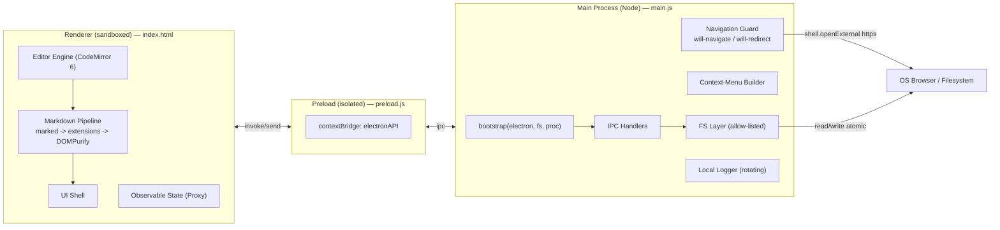
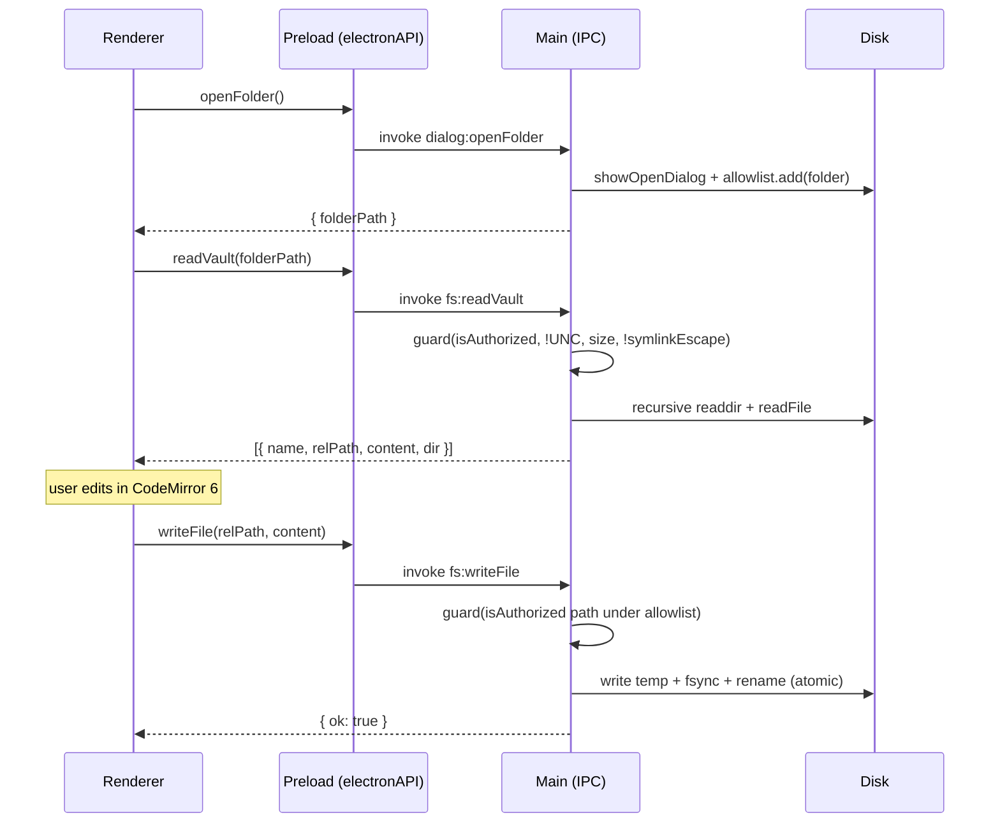
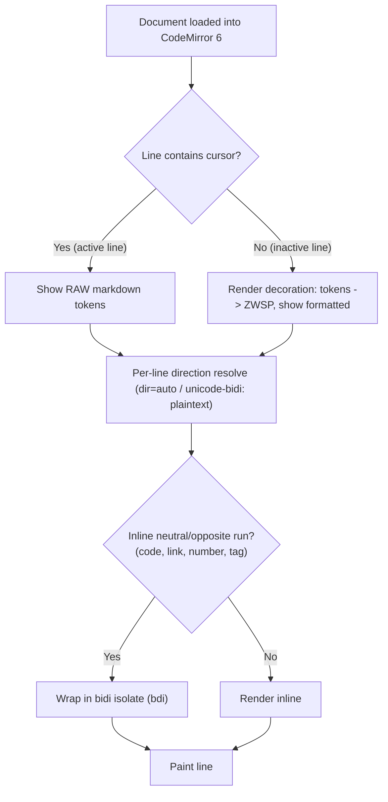
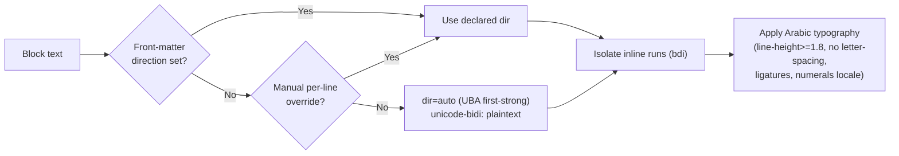
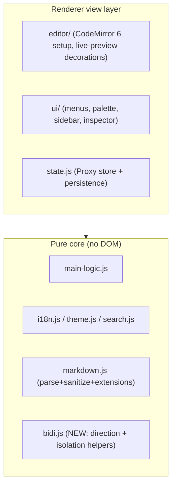
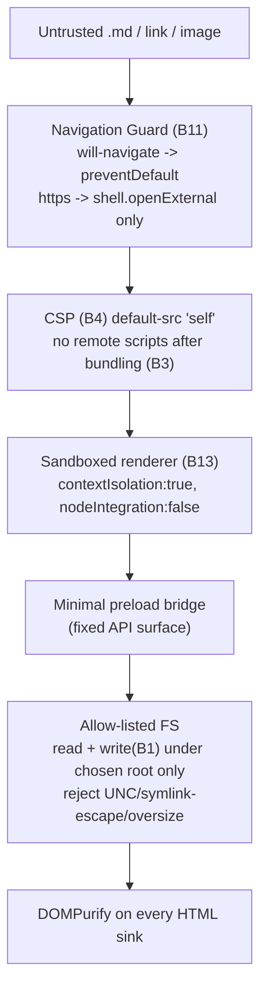
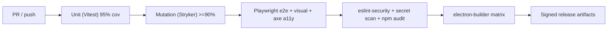

# BP MD RTL Reader — Technical Specification (SPEC.md)

> **Status:** Draft v1.0 · **Owner:** Binary Parse · **Standard:** 2026 architecture/security/accessibility baselines
> **Scope:** Consolidates the Master Assessment & Backlog into a ship-ready engineering specification.
> **Audience:** Implementers (human or agentic), reviewers, release engineers.

---

## 0. Architectural Reasoning (pre-draft)

Before the formal spec, the design constraints, patterns, bottlenecks, and dependencies that shape every decision below.

### 0.1 Design patterns in force (keep these)
| Pattern | Where | Why it stays |
|---|---|---|
| **Dependency-Injection seam** | `bootstrap({electron, fs, proc})` in `main.js`, `setupBridge({contextBridge, ipcRenderer})` in `preload.js` | Enables unit + mutation testing without launching Electron; do **not** regress |
| **Capability-isolated bridge** | `preload.js` exposes a fixed, minimal API surface | Principle of least privilege; renderer never touches Node |
| **Allow-list capability security** | `allowedFolders` Set gates all FS access | Untrusted `.md` cannot escape the chosen folder |
| **Pure-function core** | `src/main-logic.js`, `src/renderer/*.js` (i18n, theme, search, markdown, state) | Deterministic, 95% coverage gate, Stryker-friendly |
| **Observable state store** | `createState()` Proxy in `state.js` | Single source of truth in the renderer |
| **Sanitize-on-render** | DOMPurify on every HTML sink | Defense-in-depth against malicious Markdown |

### 0.2 Known bottlenecks & architectural risks
| Risk | Impact | Mitigation (spec item) |
|---|---|---|
| **Monolithic `index.html`** (3,226 lines: HTML+CSS+JS) | Maintenance bottleneck; blocks parallel work | F12 decomposition; CM6 module boundary (F13) |
| **Full `innerHTML` re-render** per edit/render | Re-parses whole tree; loses scroll/selection; O(n) per keystroke region | F13 (CM6 incremental decorations) |
| **CDN runtime dependency** (marked/DOMPurify/fonts) | Breaks offline first-run; contradicts local-first; GDPR exposure | B3 (vendor) + B4 (CSP) |
| **No write-to-disk path** | "Editor" cannot save; downloads copies | B1 (`fs:writeFile` IPC) |
| **Whole-document RTL** | Wrong for bilingual docs; coarser than competitors | R1/R2 (per-line + bidi isolation) |
| **`<textarea>` editing surface** | Cannot do hybrid live-preview or per-line bidi cursor | F13 (CodeMirror 6) |
| **No navigation guard** | Link click navigates renderer away → app "stuck"; security vector | B11 (`will-navigate`) |

### 0.3 Dependency graph (current → target)
| Dependency | Current | Target | Notes |
|---|---|---|---|
| `marked` | CDN @18 | bundled (local) | Markdown parse |
| `DOMPurify` | CDN @3.4 | bundled (local) | Sanitize |
| Fonts (Fraunces/Inter/JetBrains/IBM Plex Arabic) | Google Fonts CDN | self-host WOFF2 + Arabic subset | T1/T3 |
| **CodeMirror 6** | — | **add** | Unified editor engine (F13) |
| KaTeX | — | add (lazy) | Math (F9) |
| Mermaid | — | add (lazy) | Diagrams (F16) |
| highlight.js / Shiki | — | add | Code highlighting (F9) |

---

## 1. Overview & Goals

### 1.1 Product overview
BP MD RTL Reader is a **local-first, privacy-respecting, bilingual (English/Arabic) Markdown reader** built on Electron. It reads plain `.md` files from disk with zero lock-in, an editorial reading aesthetic, and first-class right-to-left support.

### 1.2 Goals (this spec)
1. **G1 — Truthful local-first:** zero network at runtime; everything bundled; no telemetry.
2. **G2 — Correct & safe navigation:** external links never hijack the window; full contextual right-click.
3. **G3 — Real editing:** edits persist to the original file via a hardened write path.
4. **G4 — One unified editing mode:** replace 3 modes with a CodeMirror-6 hybrid Live Preview (+ optional Source toggle).
5. **G5 — Best-in-class RTL:** per-line direction, bidi isolation everywhere, native Arabic typography, optional fully-Arabic UI.
6. **G6 — 2026 rendering baseline:** callouts, task lists, math, mermaid, syntax highlighting, PDF export.
7. **G7 — Compliance-grade a11y:** WCAG 2.2 AA + European Accessibility Act baseline.

### 1.3 Non-goals
- Cloud sync, accounts, or collaboration (explicitly out — preserves local-first).
- Proprietary file format (always plain `.md`).
- Plugin ecosystem (v1 scope).
- Mobile/touch UI (desktop-first; macOS/Linux are packaging-only).

### 1.4 Identity guardrails (do not regress)
- No telemetry / no auto-update phone-home / `crashReporter.uploadToServer:false`.
- `contextIsolation:true`, `nodeIntegration:false`, sandboxed renderer.
- DI seams (`bootstrap`/`setupBridge`) and pure-function core preserved.

---

## 2. Success Criteria

| ID | Criterion | Measurable target |
|---|---|---|
| SC1 | Offline first-run renders Markdown | Disconnect network → open `.md` → fully styled render (no raw text) |
| SC2 | No runtime network requests | DevTools/Network shows **0** external requests on cold start |
| SC3 | External links open in OS browser | Click `https://` link → opens default browser; app stays on `index.html` |
| SC4 | Right-click works everywhere | Link, image, selection, editable, empty area each yield a relevant menu |
| SC5 | Edits persist to disk | `Ctrl+S` writes original file atomically; reopened file shows changes |
| SC6 | Single unified editing mode | Read formatted; cursor-on-line reveals raw Markdown; Source toggle optional |
| SC7 | Bilingual correctness | Mixed AR/EN doc renders each line/inline-run in correct direction |
| SC8 | A11y baseline | axe: 0 serious/critical; keyboard-only traversal of all controls; focus visible |
| SC9 | Rendering baseline | Callouts, task lists, KaTeX, mermaid, highlighted code all render |
| SC10 | Quality gates hold | ≥95% line coverage, ≥90% mutation score, all e2e + visual + a11y green |

---

## 3. Technical Architecture

### 3.1 Process model (Electron)


### 3.2 IPC sequence — open & save (target state, with B1/B2/B11)


### 3.3 Unified editor (F13) — hybrid Live Preview decision flow


### 3.4 RTL direction resolution (R1/R2)


### 3.5 Module boundaries (target after F12/F13)


---

## 4. Schema & API Definitions

### 4.1 IPC contract (preload `electronAPI`)
| Channel | Direction | Signature | Status | Guards |
|---|---|---|---|---|
| `dialog:openFolder` | invoke | `() => {canceled, folderPath}` | exists | adds folder to allow-list |
| `fs:readVault` | invoke | `(folderPath) => Note[] \| {error}` | exists → **extend (B2)** | allow-list, UNC, size, symlink, **recursion** |
| `fs:writeFile` | invoke | `(relPath, content) => {ok} \| {error}` | **NEW (B1)** | path resolves under allow-listed root; atomic write |
| `edit:command` | send | `(cmd: EditCmd) => void` | exists | native role dispatch |
| `open-external-file` | on | `({name, path, content}) => void` | exists | file-association |
| `log:error` | send | `({message, stack}) => void` | exists | rate-limited 100/min |
| `window-*` | send | minimize/maximize/close | exists | — |

### 4.2 Core data model
```ts
// Note (renderer state + readVault result)
interface Note {
  name: string;            // "essay.md"
  relPath: string;         // "essays/essay.md" (vault-relative; B2)
  content: string;         // UTF-8, BOM-stripped
  dir?: 'ltr' | 'rtl' | 'auto';   // R6: front-matter / override; default 'auto'
  handle?: unknown | null; // FSA handle (browser/dev only)
  dirty?: boolean;
}

// fs:writeFile request/response
type WriteReq  = { relPath: string; content: string };
type WriteResp = { ok: true } | { error: WriteError };
type WriteError =
  | 'unauthorized-path' | 'network-path-not-allowed'
  | 'oversize' | 'write-failed';
```

### 4.3 Persistent settings store (B5/F8) — `<userData>/settings.json`
```ts
interface Settings {
  version: 1;
  theme: 'paper' | 'ink' | 'sepia';
  zoomFactor: number;             // 0.6–2.0
  editorMode: 'live' | 'source';  // F13: 'split' deprecated
  sidebarVisible: boolean;
  inspectorVisible: boolean;
  uiDirection: 'ltr' | 'rtl';     // R7: full-UI direction
  uiLocale: 'en' | 'ar';          // R7: UI language
  numerals: 'western' | 'arabic-indic';  // R5
  calendar: 'gregorian' | 'hijri';       // R8
  recents: { name: string; path: string }[];   // max N
  window: { x?: number; y?: number; w: number; h: number; maximized: boolean };
  lastSession?: { vaultPath?: string; openPaths: string[]; activePath?: string };
}
```

### 4.4 Markdown front-matter (per-note direction, R6)
```yaml
---
direction: rtl        # ltr | rtl | auto
---
```

### 4.5 Supported Markdown surface (target, F9/F14/F15/F16)
| Feature | Syntax | Renderer |
|---|---|---|
| GFM core | tables, `~~strike~~`, `- [ ]` task list | marked GFM |
| Callouts | `> [!NOTE]` (+ TIP/IMPORTANT/WARNING/CAUTION) | custom extension |
| Math | `$inline$`, `$$block$$` | KaTeX (lazy) |
| Diagrams | ```` ```mermaid ```` | Mermaid (lazy) |
| Code highlight | fenced + lang | highlight.js/Shiki |
| Wiki-links | `[[note|alias]]` + autocomplete | custom extension |

---

## 5. Security & Deployment Strategy

### 5.1 Security model (defense-in-depth)


### 5.2 Security checklist (acceptance)
| Control | Requirement |
|---|---|
| Navigation | `will-navigate` + `will-redirect` preventDefault; `setWindowOpenHandler` deny; `openExternal` **https-only** |
| Renderer | `sandbox:true`, `contextIsolation:true`, `nodeIntegration:false`, `webSecurity:true` |
| CSP | `default-src 'self'; img-src 'self' data:; style-src 'self' 'unsafe-inline'; script-src 'self'` |
| FS writes | resolved real path must be inside an allow-listed root; atomic temp+rename |
| Network | zero outbound at runtime (assets bundled) |
| Sanitization | DOMPurify on render, modal, export; KaTeX/Mermaid output sanitized/trusted-pipeline |

### 5.3 Deployment / build matrix
| Target | Arch | Format | Notes |
|---|---|---|---|
| Windows | x64, ia32, arm64 | NSIS + portable + Inno | current |
| macOS | x64, arm64 | dmg/zip (notarized) | B7 |
| Linux | x64, arm64 | AppImage/deb | B7 |

### 5.4 CI/CD gates (must pass to ship)


---

## 6. Workstream Complexity & Risk (actionable)

| ID | Workstream | Complexity | Effort | Risk | Depends on |
|---|---|---|---|---|---|
| B11 | Navigation guard | Low | S | Low | — |
| B12 | Full context menu | Low | S–M | Low | B11 |
| B13 | Sandbox renderer | Low | S | Med (preload audit) | — |
| B3 | Vendor assets (marked/DOMPurify/fonts) | Low | S | Low | — |
| B4 | CSP | Low | S | Med (inline styles) | B3 |
| T1/T3 | Correct + self-hosted fonts | Low | S | Low | B3 |
| B1 | `fs:writeFile` (atomic, allow-listed) | Med | M | Med (data safety) | — |
| B2 | Recursive vault | Med | M | Low | — |
| F1 | Folder tree UI | Med | M | Low | B2 |
| R1/R2 | Per-line dir + bidi isolation | Med | M | Med (edge cases) | (F13 ideal) |
| R3/R4/R5 | Arabic typography/numerals | Low | S | Low | T1 |
| F2–F5 | A11y (labels/aria-live/focus/menu nav) | Low | S–M | Low | — |
| F9/F14/F15/F16 | Rendering features | Med | M | Low | B3 |
| F13 | **CodeMirror 6 unified editor** | **High** | **L** | **High** | B1, R1 |
| R9 | Bidi tables + cursor | High | M | Med | F13 |
| R7 | Full RTL/Arabic UI | High | L | Med | F8/B5 |
| F12 | Decompose index.html | Med | L | Med | — |

---

## 7. Implementation Phases (sequenced)

| Phase | Theme | Items | Exit |
|---|---|---|---|
| 1 | Stop the bleeding | B11, B12, B13 | SC3, SC4; security checklist green |
| 2 | Make claims true | B3, B4, T1, T3, T2 | SC1, SC2 |
| 3 | Core feature real | B1 → B2 → F1 | SC5 |
| 4 | RTL correctness | R1, R2, R3, R4, R5 | SC7 (non-table) |
| 5 | Accessibility | F2, F3, F4, F5, T4, T5 | SC8 |
| 6 | Persistence & docs | B5, F8, B8 | session restore verified |
| 7 | Editor rewrite (flagship) | F13 + B1 in-place + R9 | SC6, SC7 (tables) |
| 8 | Rendering baseline | F9, F14, F15, F16, F7, B6/F6 | SC9 |
| 9 | RTL moats | R7, R8, R10, R6 | Arabic UI shippable |
| 10 | Reach & cleanup | B7, B9, B10, F10, F11, T6, F12 | cross-platform builds |

---

## 8. "Done" Criteria (agentic validation)

Each item is **Done** only when **all** of the following hold. Global gates apply to every PR.

### 8.1 Global gates (every change)
- [ ] `npm run test:unit` green; **line coverage ≥ 95%**.
- [ ] `npm run test:mutation` (Stryker) **≥ 90%** on touched modules.
- [ ] `npm run test:e2e` (Playwright) incl. **visual-regression** and **axe a11y** green.
- [ ] `npm run lint:security` 0 errors; secret scan + `npm audit` clean.
- [ ] No new runtime network request (SC2 probe in e2e).
- [ ] DI seams preserved (`bootstrap`/`setupBridge` still importable without side-effects).

### 8.2 Per-workstream acceptance
| ID | Done when… |
|---|---|
| **B11** | e2e: clicking an `https` link opens OS browser (mocked `shell.openExternal` called) and renderer URL stays `index.html`; `will-navigate`/`will-redirect` handlers unit-tested for http/file/internal cases. |
| **B12** | Context menu unit tests cover link, image, selection, editable, and empty-area; link items route via https-only `openExternal`; non-http never opened. |
| **B13** | `sandbox:true` asserted in BrowserWindow options test; preload still functions; no Node API reachable from renderer (e2e probe). |
| **B3** | Network panel shows 0 external requests; assets resolve from app bundle; SRI removed (local). |
| **B4** | CSP meta present; violations logged none in e2e; no inline `<script>`. |
| **T1/T3** | `font-synthesis: none` set; visual-regression confirms **real** bold (Latin + Arabic) — no faux-bold; fonts served locally (subset). |
| **B1** | Edit → save → file on disk byte-matches; crash-safety via temp+rename verified; out-of-allow-list path rejected with `unauthorized-path`. |
| **B2** | Vault with nested folders returns all `.md` with correct `relPath`; depth-bounded; symlink-escape still rejected. |
| **F1** | Tree renders hierarchy, collapse/expand, keyboard-navigable, RTL filenames isolated; selection drives active note. |
| **R1/R2** | Mixed AR/EN doc: each block direction = first-strong char; inline code/link/number isolated (snapshot tests for lists, quotes, callouts, tables, code). |
| **R3/R4/R5** | Arabic body `line-height ≥1.8` (≥2.0 w/ tashkeel); no `letter-spacing`; ligatures present; numerals toggle switches digit shape; numbers stay LTR. |
| **F2–F5** | Every icon control has `aria-label`; toast is `role="status"`/`aria-live="polite"`; modal/palette trap & restore focus; menus fully arrow-key operable. |
| **F9/F14/F15/F16** | Callouts, task-list checkboxes, KaTeX, mermaid, highlighted code each have a render test + visual snapshot. |
| **F13** | Single editor: inactive lines render formatted, active line shows raw tokens; Source toggle works; selection/scroll preserved across edits; per-line direction + cursor correct in mixed text; old 3-mode switch removed; performance: render of a 10k-line doc < 100ms initial, < 16ms per keystroke region. |
| **R9** | Mixed-direction table: columns mirror for RTL, each cell `dir=auto`; arrow-key cell traversal is logical; snapshot + interaction test. |
| **R7** | Full UI flips (layout mirrored, glyphs mirrored) and localizes (en/ar) via `uiLocale`; persisted; RTL visual snapshot of chrome. |
| **B5/F8** | Relaunch restores theme, zoom, mode, panels, recents, window geometry, last session. |

---

## 9. Open Questions / Decisions Required
| # | Decision | Options | Recommendation |
|---|---|---|---|
| Q1 | Editor engine | CodeMirror 6 vs ProseMirror | **CodeMirror 6** (md fidelity + RTL/bidi) |
| Q2 | Save model | explicit `Ctrl+S` vs autosave | Autosave + manual flush + "saved" indicator |
| Q3 | Highlighter | highlight.js vs Shiki | Shiki (themes) if bundle size acceptable, else highlight.js |
| Q4 | "Split" mode | keep vs drop | Drop; replace with unified + Source toggle |
| Q5 | Code signing | cert authority/budget | Required for macOS notarization (B7) |

---

## 10. Appendix — Backlog ID Index
- **B** (backend/main): B1 write IPC · B2 recursive vault · B3 vendor assets · B4 CSP · B5 persist state · B6 printToPDF · B7 platforms · B8 docs · B9 fs.watch · B10 .txt · B11 nav guard · B12 context menu · B13 sandbox
- **F** (frontend/UX): F1 folder tree · F2 aria-label · F3 aria-live · F4 focus trap · F5 menu nav · F6 PDF export · F7 outline h1–h6 · F8 UI prefs · F10 cosmetics · F11 italic/chevrons · F12 decompose · F13 unified editor
- **Fr** (rendering): F9 highlight+KaTeX · F14 callouts · F15 task lists · F16 mermaid
- **T** (typography): T1 weights · T2 font-synthesis · T3 self-host · T4 zoom/rem · T5 min sizes · T6 opsz
- **R** (RTL/Arabic): R1 per-line dir · R2 bidi isolation · R3 Arabic type defaults · R4 weights/ligatures · R5 numerals · R6 per-note dir · R7 full RTL UI · R8 Hijri · R9 bidi tables · R10 justification

---

*End of SPEC.md — Draft v1.0.*
