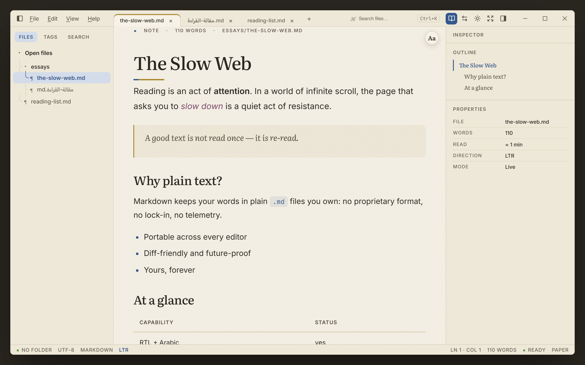
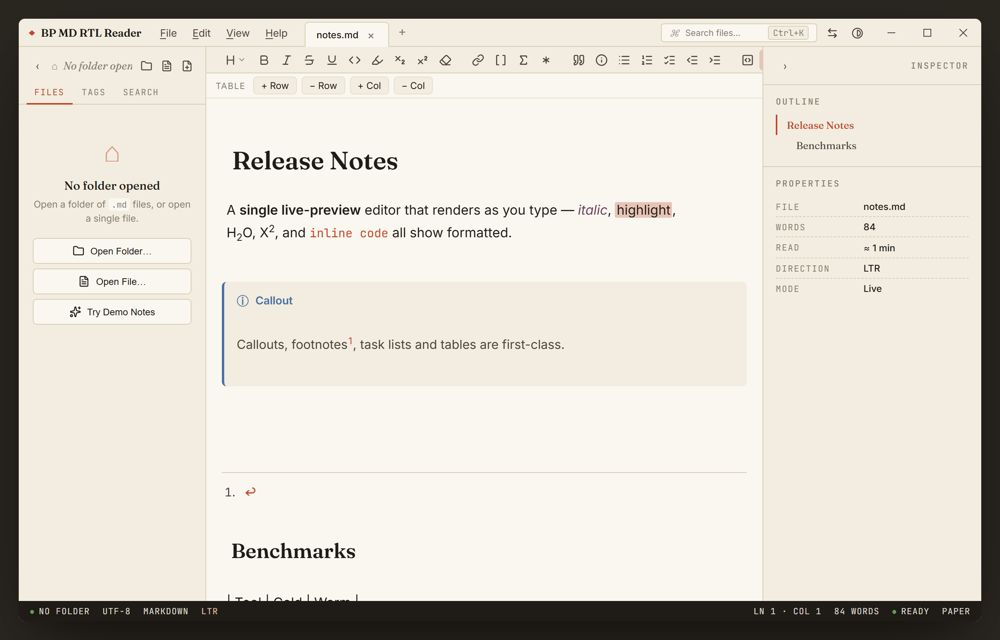
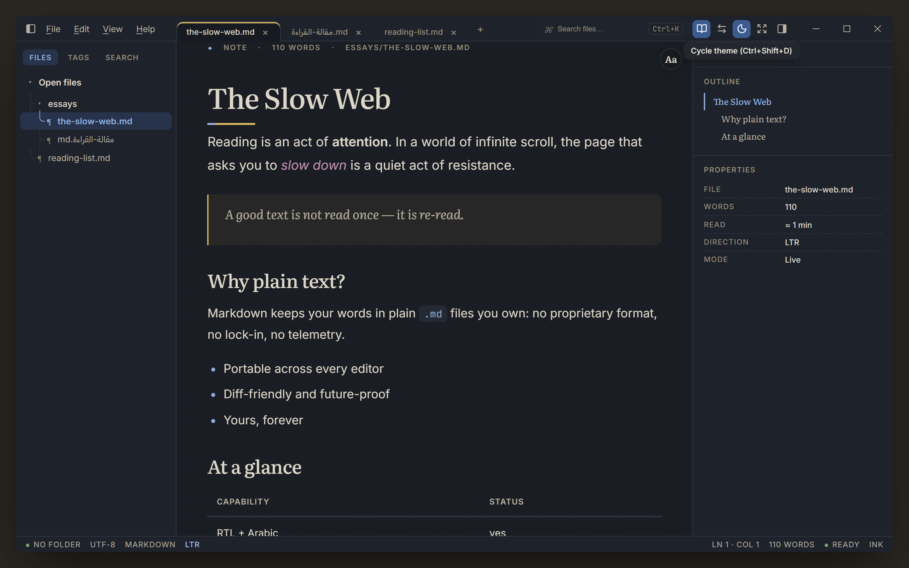
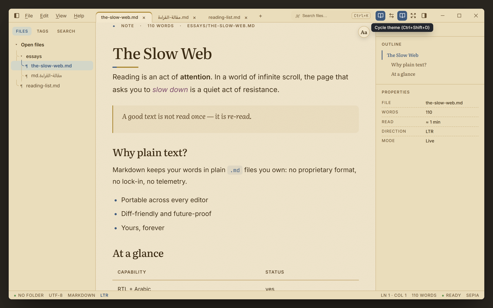
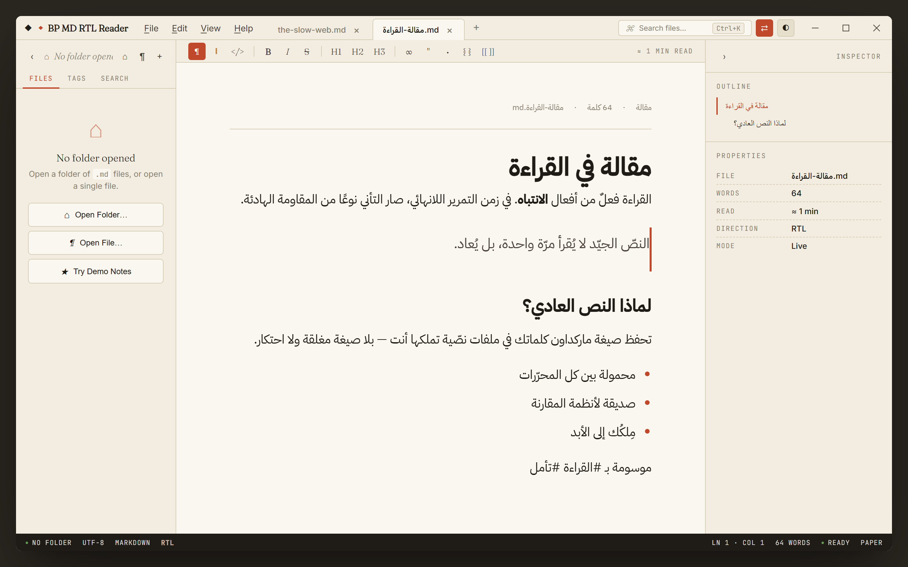
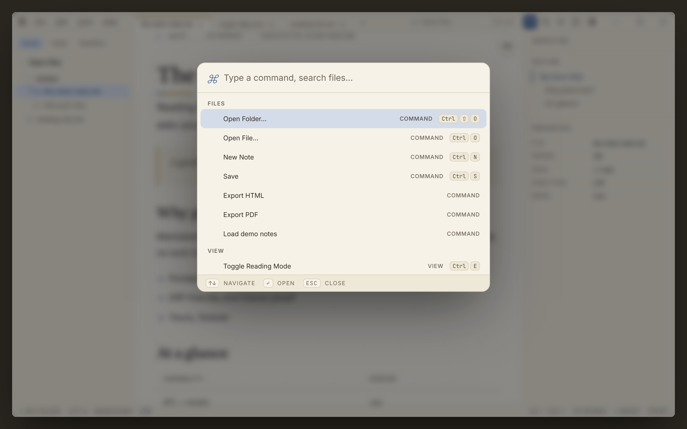

# User Guide

A tour of everything **BP MD RTL Reader** can do. For the full key list see
[Keyboard Shortcuts](KEYBOARD_SHORTCUTS.md); for privacy details see
[Privacy & Security](PRIVACY.md).

## Contents

- [The window at a glance](#the-window-at-a-glance)
- [Opening your notes](#opening-your-notes)
- [The editor](#the-editor)
- [Writing & formatting](#writing--formatting)
- [Themes](#themes)
- [Arabic & right-to-left](#arabic--right-to-left)
- [Finding things](#finding-things)
- [Tags & wiki-links](#tags--wiki-links)
- [The inspector](#the-inspector)
- [Creating & exporting](#creating--exporting)
- [What gets remembered](#what-gets-remembered)

---

## The window at a glance

| Area | What it does |
| ---- | ------------ |
| **Title bar** | App name, the menu bar (File · Edit · View · Help), search shortcut hint, and window controls. |
| **Sidebar** (left) | Three tabs — **Files** (your folder tree), **Tags**, and **Search**. Toggle with `Ctrl+\`. |
| **Tab bar** | One tab per open file; a `●` marks unsaved changes. The `+` opens a new note. |
| **Toolbar** | View-mode switches, formatting, theme (◐), and direction (⇄) buttons. |
| **Editor / preview** | Where your document is shown — as preview, source, or both. |
| **Inspector** (right) | Document **outline** and **properties**. Toggle with `Ctrl+Shift+I`. |
| **Status bar** | Folder, encoding, format, direction, cursor position, word count, and theme. |

---

## Opening your notes

There are three ways in:

- **Open a file** — `Ctrl+O`, or the **¶** button. Each file opens in its own tab;
  open as many as you like.
- **Open a folder ("vault")** — `Ctrl+Shift+O`, or the **⌂** button. Every `.md` and
  `.markdown` file appears in the **Files** tree, sorted alphabetically. Click any
  entry to read it.
- **Drag & drop** — drop `.md`, `.markdown`, or `.txt` files (up to 10 MB each) onto
  the window to open them as tabs.

You can also double-click a `.md` file in Windows Explorer if you enabled the file
association during install — it opens in a new tab.

> **No notes yet?** Choose **File → Load Demo Notes** (or **Try Demo Notes** on the
> welcome screen) to load a small bilingual sample set, including an Arabic essay.

---

## The editor

There is a single, unified **live-preview** editor. Your text renders as you read it —
headings, bold/italic, links, callouts, tables, math, and images all appear formatted —
while the line your cursor is on shows the raw Markdown so you can edit it. Move the
cursor away and that line renders too. There are no separate "source" or "split" modes
to juggle: writing and reading are the same surface.

**Zoom** with `Ctrl+=`, `Ctrl+-`, and `Ctrl+0` (60–200%); the rest of the interface stays put.

---

## Writing & formatting

A formatting toolbar sits above the editor. The tools are **toggles**, not blunt inserts —
applying a style again removes it, and switching heading level or list type *replaces*
rather than stacks markers. With nothing selected, an inline style wraps the word under
the cursor; with a selection, the selection stays selected afterward. A button lights up
when the cursor is inside that construct.

- **Headings** — the **H▾** dropdown sets H1–H6 (or `Ctrl+1`–`Ctrl+6`); choosing the
  current level again turns it back into a paragraph.
- **Inline** — **Bold** (`Ctrl+B`), *Italic* (`Ctrl+I`), ~~Strikethrough~~, <u>Underline</u>,
  `Inline code`, ==Highlight==, Subscript (`~x~`), Superscript (`^x^`), and **Clear
  formatting** (strip styles from the selection).
- **Insert** — Link, Wiki-link (`[[note]]`), Math (`$…$`), and **Footnote** (drops a `[^1]`
  reference plus a definition at the end of the note).
- **Blocks** — Blockquote, Callout (`> [!NOTE]`), Bulleted / Numbered / Task lists, with
  **Indent / Outdent** (or `Tab` / `Shift+Tab`) to nest list items.
- **Big blocks** — Code block, Table, Image, and Horizontal rule. These always land on
  their own line — inserting one never splits the text you're on.

**Tables are interactive.** When the cursor is inside a table, a controls bar appears with
**+ Row / − Row / + Col / − Col**, and `Tab` / `Shift+Tab` move between cells (pressing
`Tab` past the last cell adds a new row).

---

## Themes

Three reading themes, switched with the **◐** button or `Ctrl+Shift+D` (Paper → Ink →
Sepia). Your choice is saved and restored on the next launch.

| Paper | Ink | Sepia |
| :---: | :-: | :---: |
|  |  |  |

---

## Arabic & right-to-left

BP MD RTL Reader is bilingual at its core.

- **Automatic detection.** When you open a document whose text is predominantly
  Arabic, the layout flips to right-to-left automatically, with Arabic-aware fonts,
  heading alignment, and weight.
- **Manual flip.** Press `Ctrl+Shift+L` (or the **⇄** button) to set the direction
  yourself; your choice then sticks for that document.
- **Mixed content** is handled per element, so embedded English in an Arabic document
  (and vice-versa) reads correctly.

---

## Finding things

- **Find in document** — `Ctrl+F` opens a find bar with a hit counter and next/previous
  navigation. Matches are highlighted in the preview; in source view the match is
  selected.
- **Command palette** — `Ctrl+K` searches every menu command *and* your open files.
  Arrow keys to move, `Enter` to run, `Esc` to dismiss.

- **Vault search** — the **Search** tab in the sidebar searches filenames and contents
  across the open folder, showing context snippets. Click a result to open it.

---

## Tags & wiki-links

- **Tags** — write `#tag` anywhere in a note. The **Tags** sidebar tab shows every tag
  across the vault as a frequency-sorted cloud; click one to search for it. Tags are
  Unicode-aware, so Arabic tags like `#تأمل` work too.
- **Wiki-links** — link between notes with `[[Note Title]]`, or use an alias with
  `[[Note Title|display text]]`. Click a link to jump to that note.

---

## The inspector

Toggle the right-hand inspector with `Ctrl+Shift+I`. It has two parts:

- **Outline** — every `H1`/`H2`/`H3` heading in the current document; click to jump.
- **Properties** — file name, word count, estimated read time, text direction, and the
  current view mode.

---

## Creating & exporting

- **New note** — `Ctrl+N` creates a blank, titled note.
- **New daily note** — `Ctrl+Shift+N` creates (or opens) a note named for today's date.
- **Save / Save As** — `Ctrl+S` and `Ctrl+Shift+S` write your changes back to disk.
- **Export HTML** — **File → Export HTML** produces a single self-contained `.html`
  file (embedded styles, correct `lang`/`dir`) you can share or archive.

Tabs with unsaved edits show a `●`; closing one — or the window — prompts you first.

---

## What gets remembered

BP MD RTL Reader keeps things deliberately simple and local:

- **Saved:** your theme choice, restored on launch.
- **Per session:** open tabs, recent files, and unsaved edits live until you close the
  app — your files only change on disk when you **Save**.

Everything is stored under `%APPDATA%\BP MD RTL Reader`. Nothing leaves your machine —
see [Privacy & Security](PRIVACY.md).
