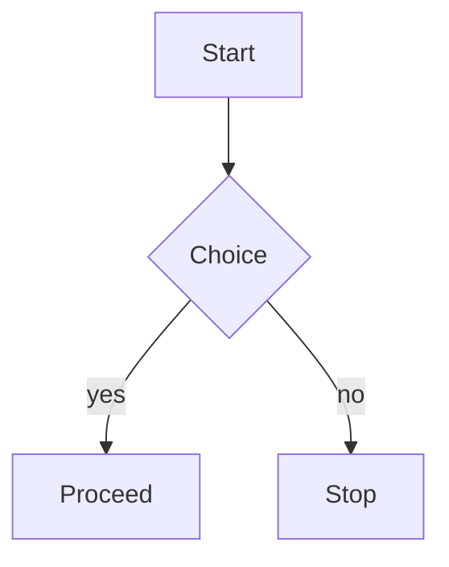

# Diagrams

A flowchart diagram:



An invalid diagram must fall back to its code block:

```mermaid
@@@ this is not a valid mermaid diagram @@@
```

فقرة عربية حول المخطط أعلاه للتأكد من بقاء المخطط من اليسار إلى اليمين.
